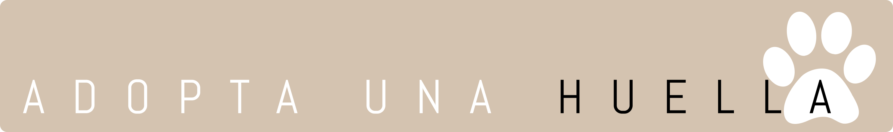
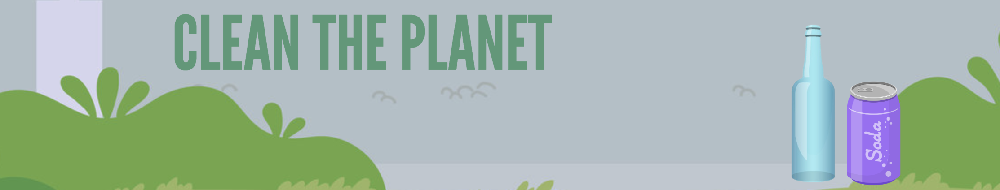

### Hi there, I'm Leticia 

## 👩🏻‍💻 About me

## 🔧 Technologies & Tools

## ✨ My projects

### Adopta una huella

 
 
Developed with: JavaScript, Node, Express, Mongo & React (check the repo <a href="https://github.com/AndreaAlarcon99/adopta-una-huella-FRONT">here</a>).

### My Meme

 
 
Developed with: JavaScript, Node, Express & Mongo (check the repo <a href="https://github.com/JusiBP/myMeme">here</a>).

### Clean the planet

 
My solo first project developed after two weeks learning how to code. Clean the planet is a kids game where you must move the yellow bin to recycle cans.
 
Developed with: JavaScript, HTML, CSS & Canvas (check the repo <a href="https://github.com/LeticiaSantosPoveda/Clean-the-planet">here</a>).

---

Contact me!

